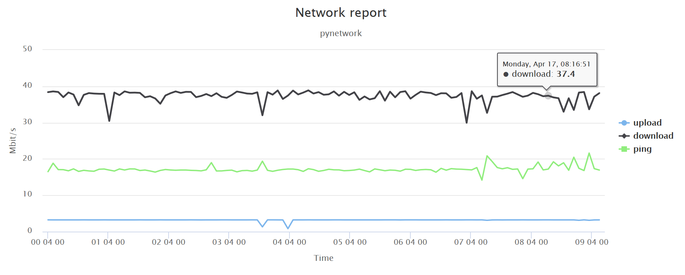

# Pynetwork

Designed to run as Linux crontab job on Raspberry Pi, for network ping/upload/download speed measurements and analysis.


## Usage

In a terminal:

```
$ pynetwork.py -u 2 -d 25 -p 4
```

```
$ pynetwork.py -h

	usage: pynetwork.py [OPTION]...

	Network upload, download, ping speed check and notifications script

	optional arguments:
	-h, --help  show this help message and exit
	-d D        Download speed constraint
	-u U        Upload speed constraint
	-p P        Ping speed constraint
```

### Possible Configurations (can be found in config.json file):

```
{
	//Sets whether upload generated chart to Google Drive
	 "uploadResultsToGdrive" : true,
	//Sets whether use real time network check (mainly used for DEBUG purposes)
    "realNetworkCheck" : true,
	//Sets whether writing local file with the mail html content
    "writeLocalHtml" : true,
	//Sets whether send a mail when network check is completed"""
    "sendMail": true,
	//Sets for attaching chart html to mail
    "attachMailChart" : true
}

```

### Sending mail (Gmail only)
If you want to send mail you'll need to fill ./secret/mail.secrets.json file:

```
{
	//Mail receiver
	"recieverGmailAccount" : "<receiver gmail account>",
	//device gmail account
	"agentGmailAccount" : "<agent gmail account>",
	//device gmail password
	"agentGmailPassword" : "<agent gmail password>"
}
```

## chart screenshot


### Uploading collected data to Google Drive

If you want to upload generated files to Google drive, 
you'll need to provide ./secrets/client.secret.json file (can be downloaded from your Google API Console)


##Data Files:

pynetwork generates data files as its output. So you can browse history of your network performance.
* Daily charts can be found under : ./data/<date>chart.html
```
Data files hierarchy:
	./data
		/<date directory>
        	/<date>_data.json    (global data file: contains all of the information)
```

## Dependencies

```
pip install pyspeedtest
pip install mail
pip install requests
pip install --upgrade google-api-python-client
pip install httplib2
pip install jinja2
```
